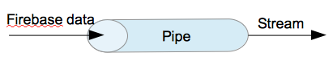

# Use Firebase with Angular2 and RxJs
This package is made with Typescript.
## How does it work?

The basic idea is really simple, we use the power of RxJs to turn simple data from Firebase into a stream. So all we need to do is to declare a reference on the firebase url and wrap the incoming data inside an Observable.
* Declare a reference
    ```
    private _ref: Firebase;
    ```

    ```
    constructor() {
        this._ref = new Firebase('your_firebase_url');
    }
    ```
* Wrap the incoming data
    ```
    // @params eventType -> the name of the event ("value", "child_added", "child_changed", "child_removed", or "child_moved.")
    // @params path -> the node you want to get data if nothing set just take the root.
    public observe(eventType: string, path: string = '/'): Observable<any> {
            var observable: Observable<any> = new Observable(observer => {
                // Move to the node then listen on the ref
                var listener = this._ref.child(path).on(eventType, snapshot => {

                    // Say to observers : "Hey I am a new data !"
                    observer.next(snapshot);

                }, error => {
                    // Oops something went wrong
                    observer.error(error);
                });

                // Stop listening on destroy
                return function() {
                  ref.off(eventType, listener);
                };
            });

        // Finally give the stream
        return observable;
    }
    ```

That's all !

Now to use it, you just need to inject this service inside your component (or a service) and call the observe method.

For my convenience I like to set the observe method in private and declare inline function who will perform the observe call for me. For example :
    ```
    public getValue(path: string): Observable<any> {
        return this.observe('value', path);
    }

    public getValue(path: string): Observable<any> {
        return this.observe('child_added', path);
    }
    ```
The purpose is to forget about the event_type and focus on how I want the data. I think it is more readable to have something like `fb_service.getValue(mypath)` than `fb_service.observe('value', mypath)`

## Thank
The original idea comes from gslotis, I take the idea and transpose it to angular2 in typescript : [Quick Firebase / RxJS binding prototype](https://gist.github.com/gsoltis/ee20138502a4764650f2)
